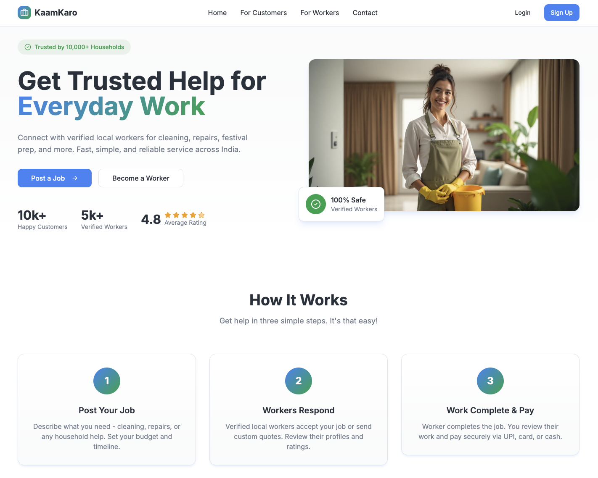
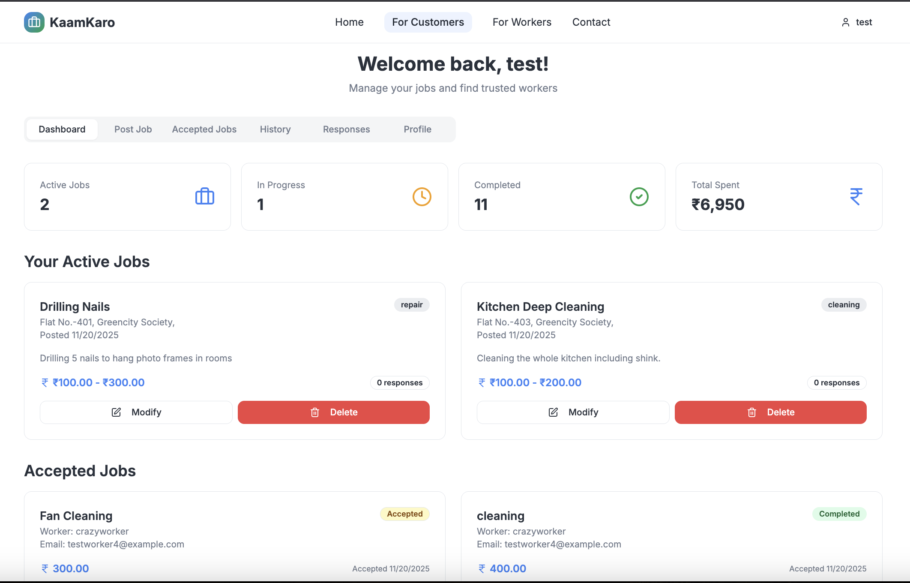
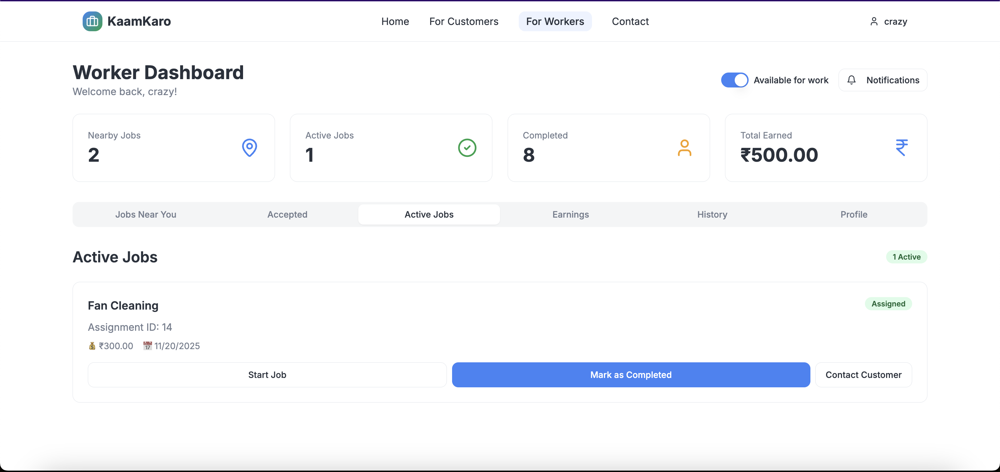

# KaamKaro

Trusted, hyperlocal micro‑job marketplace connecting households with verified local workers.

## Vision
- Make it effortless for customers to find trusted help for everyday work, and for workers to access reliable, fairly paid opportunities.
- Focus on trust, speed, and simplicity with a phone‑first experience.

## Screenshots
- Customer Dashboard: 
- Worker Dashboard: 

## Features
- Authentication and role‑based access (Customer, Worker)
- Customer portal to post jobs, manage responses, track accepted and in‑progress work
- Worker portal to browse open jobs, send quotes, accept jobs, and manage assignments
- Job lifecycle: open → accepted → in progress → completed/cancelled
- Category support including house cleaning, plumbing, electrical, carpentry, repair & maintenance, painting, gardening, cooking, and more
- Budgets: fixed or range with clear display in UI
- Responses: quotes with amount and messages; acceptance flows and assignment creation
- Ratings and reviews both ways (customer ↔ worker) with summary and distribution
- Earnings view for workers: gross, fee, and net calculations
- Trust badges and verification indicators
- Modern, responsive UI built with Tailwind + Shadcn/Radix components

## Tech Stack
- Frontend: React 18, Vite, TypeScript, TailwindCSS, Shadcn UI, Radix UI, TanStack Query
- Backend: Django 5, Django REST Framework, Simple JWT
- Database: SQLite for local dev; production recommends PostgreSQL

## Repository Structure
- `frontend/` — React app (Vite)
- `backend/` — Django project (DRF APIs)
- `frontend/public/` — Static assets and screenshots

## Local Development
Prerequisites:
- Node.js LTS, npm
- Python 3.11+, virtualenv

Setup:
1. Install frontend dependencies: `cd frontend && npm install`
2. Run frontend dev server: `npm run dev` (default `http://localhost:8080/`)
3. Create Python venv and install backend deps: `cd ../backend && python -m venv venv && source venv/bin/activate && pip install -r requirements.txt`
4. Run backend: `python manage.py migrate && python manage.py runserver 0.0.0.0:8000`

Default CORS allows `http://localhost:8080`. Frontend calls backend APIs at `http://127.0.0.1:8000/api`.

## Configuration (Production)
- Backend environment variables:
  - `SECRET_KEY` — Django secret key
  - `DEBUG` — `False` in production
  - `ALLOWED_HOSTS` — comma‑separated hostnames
  - `DATABASE_URL` — PostgreSQL connection string
  - `CORS_ALLOWED_ORIGINS` — frontend origins (e.g., `https://your-frontend-domain`)
- JWT lifetimes and authentication are configured via Simple JWT in settings.

## API Highlights
- Auth: register, login, me, profile
- Jobs: list/create/update/delete, filter by category, status
- Responses: workers create responses to jobs; customers view and accept
- Assignments: created when a response is accepted; status transitions
- Ratings: create/fetch summaries, helpful votes

## Core Flows
- Customer:
  - Post a job with title, category, description, location, and budget
  - Review worker responses and accept one to create an assignment
  - Track progress and complete job; rate and review the worker
- Worker:
  - Browse open jobs by category and location
  - Send a quote or accept a job directly when available
  - View accepted jobs, start and complete assignments; track earnings

## Deployment
- Frontend: Vercel
  - Import `frontend/` as a project
  - Build command: `npm run build`
  - Output directory: `dist`
- Backend: Render (Web Service) or Railway
  - Deploy Django app with `gunicorn` or `uvicorn` (ASGI) as appropriate
  - Set environment variables and connect PostgreSQL
  - Configure CORS and `ALLOWED_HOSTS`

## Quality
- Lint: `cd frontend && npm run lint`
- TypeScript: `tsc --noEmit` (or via `npm scripts` as configured)
- Backend migrations: `python manage.py makemigrations && python manage.py migrate`

## Security
- Never commit secrets; use environment variables
- Enable HTTPS in production with proper TLS termination
- Validate inputs server‑side via DRF serializers
- Limit CORS to trusted origins

## Roadmap
- Geo‑based matching, better notifications, payment integrations, CI/CD, observability, localization

## License
- Proprietary. All rights reserved.